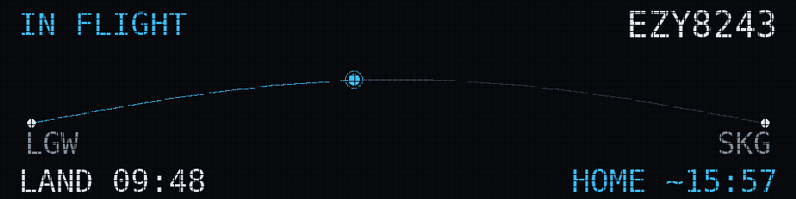

# Ident

A wall-mounted flight-duty board for the Raspberry Pi Zero. It logs into the
pilot's roster and auto-refreshes, showing the current and next duty — sectors,
report time, and first departure — alongside live route maps drawn on a bundled
coastline (rendered on-device, so the Pi needs no heavy geo libraries at runtime).
Physical buttons switch between views (e.g. a "next duty" card).

**Status:** In active development
**Stack:** Raspberry Pi Zero · Python

Part of the [slop.aero](https://github.com/captaincomplex/captaincomplex.github.io) projects site.

---

## Overview

A Raspberry Pi + LED-matrix wall that shows **your** roster, not whatever plane
happens to be overhead. Between duties it shows your next flight and report
time; during a duty it tracks the sector you're on, glances at the return
sector, and gives you a live **estimated time home** alongside the landing ETA.

Built around an easyJet LGW roster exported from **eCrew**, but the airline,
base and timezone handling are all configurable.



---

## What it does

- **Reads your roster** two ways:
  - **iCal feed** (primary) — eCrew exports to a calendar; point the wall at the
    `.ics` URL and it pulls duties automatically.
  - **Manual upload** (fallback) — drop the eCrew *Personal Crew Schedule Report*
    PDF (or any `.ics`) onto the web page.
- **Knows what to show**, by state: day off, standby, next duty (with report
  time), reported, in-flight, turnaround, heading home.
- **Tracks the live flight** while airborne (actual times + ETA), so the wall
  and the home estimate follow reality, not just the schedule.
- **Estimates your time home**: `on-chocks → +30 min debrief → +walk-to-car →
  +commute → home`. Commute is a slider, or an optional live Google Maps drive
  time at debrief o'clock.
- **Timezones**: stores everything in UTC; shows UTC, Local Base, or Local
  Station at the flick of a toggle.
- A **web control panel** for uploads, sliders, the timezone toggle, and a live
  preview of the wall — including a *time-travel* field so you can preview what
  it'll show when you land.

## Display options

The flight number prefix shown on the wall is configurable (defaults to the
ICAO **EZY**; set it to anything under *Advanced → shown on wall as*).

Three outputs, selectable in the panel:

- **Full LED (128×32)** — the recommended build. While airborne the wall shows a
  full-width **route map**: a great-circle arc from departure to arrival with a
  moving aircraft marker, the landing time and your home time in the corners.
  The text states (next duty, turnaround, heading home) right-justify the home
  value so the width isn't wasted.
- **Compact LED (64×32)** — half the panel, lower cost. Everything still fits,
  but a 64-px row only holds ~12 characters, so the in-flight view stacks the
  route, a straight progress track, the landing time and the home time; long
  routes scroll. Fewer fields are visible at once than on the full board.
- **Vestaboard (split-flap)** — see below.

## Vestaboard / split-flap feasibility

A Vestaboard is a 6×22 grid of mechanical character "Bits". It can show
letters, digits, basic punctuation and seven colour chips — **no free-form
graphics** — and every change physically flips, so updates are slow and
rate-limited. That makes it a lovely fit for the **text** states (next duty,
report time, home time) and a weak fit for a smooth live map; the route is
reduced to a coarse chip-based progress bar, e.g.

```
+----------------------+
|IN FLIGHT      EZY8243|
|                      |
|LGW ======■------- SKG|
|                      |
|LAND 09:48 HOME  15:57|
|                      |
+----------------------+
```

A `VestaboardRenderer` is included (`ident/render/vestaboard.py`). It
encodes the screen into the 6×22 character-code array and posts it via either
the **Read/Write API** (cloud key from the app) or the **Local API** (board IP +
key, faster and offline). It only pushes when the board content actually changes
and not more than once every ~15 s, to respect the flaps and the API limits.
Set *Output → Vestaboard* and paste your Read/Write key. Note Vestaboard is a
premium product (a few hundred £/$, depending on model) — check current pricing
before committing.

## Hardware (suggested)

| Part | Notes |
|------|-------|
| Raspberry Pi Zero 2 W (or Pi 4) | Pi handles the roster/timezone/state logic far more easily than the ESP32 the original Ident uses |
| Adafruit RGB Matrix Bonnet / HAT | Saves hand-wiring the HUB75 GPIO |
| 2 × 64×32 HUB75 RGB panels (=128×32) | Two chained panels give room for text; a single 64×32 works with more truncation |
| 5 V / 4 A+ PSU | LED panels are hungry; don't power them from the Pi |

The text-heavy layout is why two chained panels are recommended — a single
64×32 is tight for flight number + route + times + home line.

## Software setup

### On any machine (development / simulator)

```bash
python3 -m venv .venv && source .venv/bin/activate
pip install -r requirements.txt
python -m ident.main            # simulator + web panel on :8080
```

Open <http://localhost:8080>, drop in your roster PDF, and you'll see the wall
render in the browser. The `simulator` renderer needs no hardware.

### On the Raspberry Pi (real panels)

1. Install deps: `pip install -r requirements.txt`
2. Build hzeller's LED library (the Python binding is **not** on PyPI):
   ```bash
   git clone https://github.com/hzeller/rpi-rgb-led-matrix
   cd rpi-rgb-led-matrix
   make build-python PYTHON=$(which python3)
   sudo make install-python PYTHON=$(which python3)
   ```
3. In the web panel, set **Output → LED matrix** (and rows/cols/chain to match
   your panels), then run with `sudo` (GPIO access):
   ```bash
   sudo python -m ident.main
   ```
4. To start on boot, add a small `systemd` service that runs the same command.

## Live tracking & cost

While you're airborne (and only then), the daemon polls the configured provider
for the active sector every few minutes, merges the live data (position, ETA,
actual off/on) into that sector, and the wall + home estimate update. On the
ground it uses the roster's scheduled times.

- **AeroDataBox** (default, via RapidAPI) — query by flight number, returns a
  predicted ETA and actual times. The most direct fit for the landing time and
  home estimate. Small free tier; moved to credit-based billing in 2026.
- **Flightradar24 API** — excellent **live position** (drives the route-map
  marker), filtered by flight number. Position-centric, so ETA falls back to
  schedule unless the live record carries one. See the note below.
- **OpenSky** — free ADS-B positions matched by callsign; easyJet callsigns
  often differ from the flight number, so matches can miss. Free fallback.
- **None** — schedule only.

Tracking is polled only while airborne — a handful of calls per duty — so
free/cheap tiers are plenty. Set the provider and key under *Advanced*.

### About Flightradar24 (and a Contributor plan)

Two different products share the name:

1. **Flightradar24.com subscription / Contributor plan.** Hosting an ADS-B
   receiver earns the complimentary **Contributor** plan — premium features on
   the website and app. It does **not** include API tokens.
2. **Flightradar24 API** (`fr24api.flightradar24.com`) — a separate, credit-
   billed product with its own tokens, a free **sandbox**, and an *Explorer*
   tier aimed at hobby projects. This is what the `fr24` tracker uses.

So your Contributor status doesn't directly plug into the wall, but if you want
FR24 specifically: create an API token on the FR24 portal, pick *Explorer* (or
test in the sandbox first), and paste it under *Advanced → Flightradar24 API
token*. Because tracking only runs while airborne, credit use is tiny. FR24 is
the best choice for an accurate live **map marker**; pair it with AeroDataBox if
you also want a predicted ETA, or just use AeroDataBox alone for the simplest
ETA + home-time path.

> **Bonus if you feed FR24 yourself:** your receiver runs a local `dump1090`
> feed (JSON at `http://<receiver>/data/aircraft.json`) that's free and real-time
> for aircraft *in range of your antenna* — i.e. your departures out of and
> arrivals back into the base, though not the cruise across Europe. A
> `dump1090` tracker would be a tidy free add-on for the in-range legs; ask if
> you'd like it wired in.

## The iCal feed (AIMS eCrew format — now supported)

The **primary** path is your eCrew calendar feed. The parser
(`ident/parsers/ical_parser.py`) is built for the AIMS eCrew event format,
confirmed from a real event:

```
SUMMARY:     8301 LGW-MXP
DTSTART/END: 05:40 - 08:55          (reporting time -> arrival, not the STD)
LOCATION:    (0555Z-0755Z) LGW      (block time in UTC + departure station)
DESCRIPTION: Reporting time : 0540
             8301  - LGW  (0655) - MXP  (0855)
             * All times in Local Base (LGW)
```

Key point: AIMS pads the first event's start to the **reporting time**, so the
parser reads sector times from the **DESCRIPTION** (Local Base), uses the
`Reporting time` line for the duty report, groups per-sector events into duties
by time gap, and cross-checks against the LOCATION Zulu times. This is covered
by tests against the real event and a sample feed (`tests/fixtures/aims_sample.ics`).

The one remaining unknown is the exact wording AIMS uses for **standby / day
off / training** events — those are matched by keyword (`ESBY`, `PSBE`, `D/O`,
`FTGD`, "standby", "day off", …) and are easy to extend at the top of the parser
once you've seen how yours read. The eCrew **PDF** upload remains as a fully
tested fallback.

## Project layout

```
ident/
  models.py            roster data model (UTC internally)
  timezones.py         IATA -> tz, UTC/base/station conversion
  parsers/
    ecrew_pdf.py       eCrew Schedule Report PDF  (tested on a real roster)
    ical_parser.py     iCal feed  (tolerant; tweak to your feed's wording)
  state_engine.py      current state + home-time chain
  tracking/            AeroDataBox / OpenSky / null providers
  render/
    presenter.py       ViewModel -> display lines (timezone aware)
    simulator.py       console + PNG preview (no hardware)
    matrix.py          HUB75 output via rpi-rgb-led-matrix
  maps.py              optional Google Maps drive time
  web/                 Flask control panel
  main.py              daemon loop
tests/                 parsing + state-engine + home-math tests
```

## Tests

```bash
python tests/test_parsing_and_state.py     # 8/8 against the sample roster
```

## What's verified vs. what needs your kit

- **Verified** against real data: the eCrew **PDF** parsing, the **AIMS iCal**
  event format (sector times, reporting time, duty grouping, standby/day-off),
  the state machine, timezone conversion, and the home-time maths.
- **Needs your environment** (network / hardware, so untested here): the live
  tracking providers, Google Maps, the physical LED output, the Vestaboard API,
  and the exact wording of standby/day-off events in *your* feed. These are
  written and guarded, but expect a little tuning on first run.
